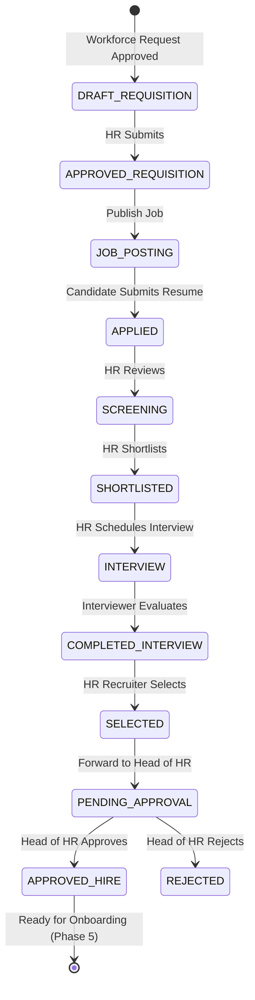

# Phase 4: Recruitment Lifecycle 

## 🏗️ Architectural Flow

The Recruitment system acts as the fourth pillar of the HRMS, tightly integrated with the existing Workforce Planning module (Phase 3). It strictly controls how an organization goes from an approved headcount request to a finalized hire.

### Models & Roles
* **Job Requisition**: Bridges an Approved `WorkforceRequest` with a public `JobPosting`.
* **Job Posting**: The external-facing job description candidates apply to.
* **Candidate** & **Application**: Stores candidate PII separately from their job-specific application status.
* **Interview** & **InterviewEvaluation**: Tracks scheduling and structured scoring feedback.
* **CandidateStatusHistory**: Immutable ledger tracking every stage transition and the user who triggered it.

### Security Enforcements (RBAC)
* **Creation (`RECRUITMENT_CREATE`)**: Only `HR_RECRUITMENT` and `HR_ADMIN` can spin up requisitions, post jobs, and schedule interviews.
* **Selection Enforcement**: Moving an application to `SELECTED` physically requires the `HR_RECRUITMENT` role.
* **Final Approval**: The final `/approve` endpoint is hard-locked to the `HEAD_OF_HR` role. Without it, the system throws a `403 Forbidden` error.

### State Machine Walkthrough

---

## 🧪 Postman Real Scenario Test Flow

The `HRMS_API.postman_collection.json` has been updated with an **"08. Recruitment (Phase 4)"** folder. 

### Prerequisites
Before testing recruitment, you must have an **Approved Workforce Request**.
1. Authenticate as `head@hr.local`.
2. Create a Department (Folder 5).
3. Create a Position linked to that Department (Folder 6).
4. Create a Workforce Request (Folder 7).
5. Submit and **Approve** that Workforce Request (Folder 7). Note its `id` (e.g., `1`).

### Testing the Recruitment Lifecycle (Folder 08)
*Note: Make sure your server is running (`npm run dev` in the backend).*

1. **Create Job Requisition**: 
   * Open `1. Create Job Requisition`. 
   * Ensure the `workforceRequestId` matches the ID you just approved. Hit Send.
2. **Approve Requisition**: 
   * Open `2. Update Requisition Status`. 
   * It transitions the requisition to `APPROVED`. Hit Send.
3. **Create Job Posting**:
   * Open `3. Create Job Posting`. 
   * Links to the requisition ID. Hit Send.
4. **Publish Job**: 
   * Open `4. Publish Job Posting`. 
   * Changes status to `PUBLISHED` so candidates can apply.
5. **Candidate Applies**: 
   * Open `5. Submit Application (Candidate)`. 
   * Submits Alice's resume to the system. Hit Send. Note the `applicationId` returned.
6. **Screening / Shortlisting**: 
   * Open `6. Update Application Status`. 
   * You can test transitioning the candidate to `SCREENING` and then `SHORTLISTED` by changing the `status` string in the JSON body.
7. **Interviewing**: 
   * Open `7. Schedule Interview`. Hit Send. *(Note: This automatically updates the application status to `INTERVIEW` in the background!)*
   * Open `8. Submit Interview Evaluation` and score the candidate.
8. **Selection**:
   * Open `6. Update Application Status` again. 
   * Change the status to `SELECTED`, then hit send.
   * Change the status to `PENDING_HEAD_OF_HR_APPROVAL`, then hit send.
9. **Final Executive Approval**:
   * Open `10. Approve Candidate (HEAD_OF_HR Only)`. 
   * Ensure you are still logged in as `head@hr.local`. Hit send.
   * *Audit Logs* are silently recorded in the background, cementing the hire!
