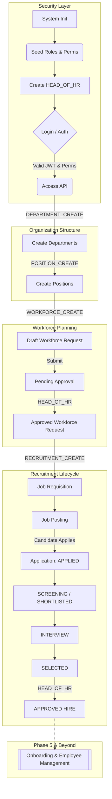
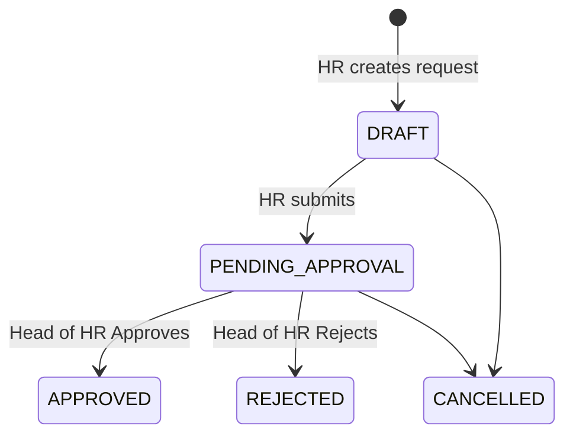
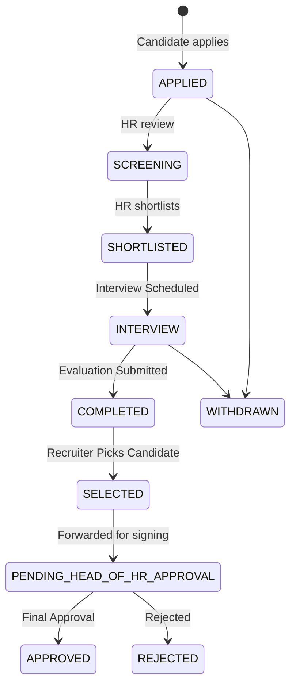

# Complete HRMS System Architecture & Flow

> **⚠️ NOTE FOR DEVELOPERS:** This is a **living document**. Whenever a new module, function, or phase is added to the system (e.g., Onboarding, Payroll, Performance), this file **must** be updated to reflect the new state machines, architectural flows, and integrations.

This document serves as the master guide for the HRMS system, explaining the journey of data from system initialization down to hiring an employee.

---

## 🏗️ 1. Macro Architecture Flow (The Big Picture)

The following diagram illustrates the complete end-to-end journey currently supported by the system.

---

## 🔐 2. Security & Foundation (Phase 1 & 2)

### Authentication Flow
1. User submits credentials to `/api/v1/auth/login`.
2. System verifies credentials against bcrypt hash in PostgreSQL.
3. System issues an `accessToken` (15m expiry) and `refreshToken` (7d expiry) via JWT.
4. **Middleware (`requireAuth`)** validates the `accessToken` on protected routes.

### Role-Based Access Control (RBAC)
The system uses granular RBAC. 
* **Permissions** are discrete actions (e.g., `DEPARTMENT_CREATE`, `USER_READ`).
* **Roles** are collections of permissions (e.g., `HR_ADMIN`, `HR_RECRUITMENT`).
* **Users** are assigned Roles.
* **Middleware (`requirePermission(['...'])`)** intercepts requests. If the user's combined roles do not possess the required permission, a `403 Forbidden` error is returned.
* *Note: Certain highly sensitive endpoints (like final approvals) bypass generic permissions and use `requireRole(['HEAD_OF_HR'])` for hard-locked executive authority.*

---

## 🏢 3. Organization & Workforce Planning (Phase 3)

Before hiring, the company must define its structure and budget.

### The Flow
1. **Departments** are created (e.g., "IT").
2. **Positions** are linked to Departments (e.g., "Software Engineer" in "IT") with defined salary bands.
3. **Workforce Requests** are drafted when a department needs headcount.

### Workforce Request State Machine

---

## 🎯 4. Recruitment Lifecycle (Phase 4)

Once headcount is approved, the recruitment engine takes over to source and evaluate candidates.

### The Flow
1. **Requisition**: An approved Workforce Request is converted into a Job Requisition.
2. **Posting**: The requisition is turned into a public-facing Job Posting.
3. **Application**: Candidates apply, creating a `Candidate` profile (PII) and an `Application` (Tracking state).
4. **Interviews**: HR schedules interviews, which automatically transitions the application status. Interviewers submit standardized numerical evaluations.
5. **Selection**: The recruiter selects the best candidate and passes them to the Head of HR for final verification.

### Application State Machine

---

## 📜 5. Audit Trail

Across all phases, the `auditService` silently records critical lifecycle events in the background (e.g., `USER_LOGIN`, `WORKFORCE_APPROVED`, `CANDIDATE_REJECTED`). This ensures a cryptographically verifiable ledger of "Who did what, and when" for compliance purposes.

---

## 🧑‍💻 6. User Guide: The Role-Based Journey

While the sections above detail the technical architecture, this section explains how the system is actually used day-to-day by different people in the organization.

### 🛠️ The System Administrator
*The person who sets up the software on Day 1.*
* **Where they start:** The User Management Dashboard.
* **Their Journey:**
  1. The System Admin logs in first.
  2. They create the digital accounts for the HR team (`/api/v1/users`).
  3. They assign specific **Roles** to those accounts (e.g., assigning the `HR_ADMIN`, `HR_RECRUITMENT`, and `HEAD_OF_HR` roles).

### 🏢 The HR Administrator (`HR_ADMIN`)
*The architect of the company structure. They define what the company looks like before anyone is hired.*
* **Where they start:** The Organization Dashboard.
* **Their Journey:**
  1. **Build Departments:** They log in and create company departments (e.g., "Engineering", "Marketing").
  2. **Define Positions:** Inside Engineering, they create open positions (e.g., "Senior Software Engineer" with a specific salary band).
  3. **Request Headcount:** If Engineering needs 3 new engineers, the HR Admin creates a **Workforce Request** for 3 headcounts and clicks *Submit*. 
  4. *They now wait for the Head of HR to approve the budget/request.*

### 👑 The Head of HR (`HEAD_OF_HR`)
*The executive decision-maker. They hold the keys to budget approval and final hiring.*
* **Where they start:** The Executive Approvals Inbox.
* **Their Journey (Part 1 - Budget Approval):**
  1. They log in and see a pending Workforce Request for "3 Senior Software Engineers".
  2. They review the justification and click **Approve** (or Reject if there is no budget).
* **Their Journey (Part 2 - Final Hiring):**
  1. Weeks later, after the recruitment team has interviewed people, the Head of HR receives a "Pending Hire" notification.
  2. They review the selected candidate's file and interview scores.
  3. They click **Approve Candidate**, making the hire official.

### 🤝 The HR Recruiter (`HR_RECRUITMENT`)
*The talent scout. They focus entirely on finding people to fill approved roles.*
* **Where they start:** The Recruitment Dashboard.
* **Their Journey:**
  1. **Job Requisition:** They see that the Head of HR just approved 3 engineers. They convert this request into an official Job Requisition.
  2. **Job Posting:** They write a job description and click **Publish**, making it visible to the public.
  3. **Review Applicants:** As resumes come in, they move candidates from *Applied* ➔ *Screening* ➔ *Shortlisted*.
  4. **Interviews:** They schedule an interview. The system automatically updates the candidate's status to *Interviewing*.
  5. **Evaluations:** After the interview, they type in the candidate's scores and feedback.
  6. **Selection:** They pick the best candidate, change their status to *Selected*, and forward it to the Head of HR for that final executive signature.

### 👤 The Candidate (External User)
*An outside applicant looking for a job.*
* **Where they start:** The company's public Careers Page.
* **Their Journey:**
  1. They browse active, Published Job Postings.
  2. They fill out a form with their Name, Email, and Resume URL.
  3. They hit *Apply*. (This instantly creates an Application record for the HR Recruiter to review).
